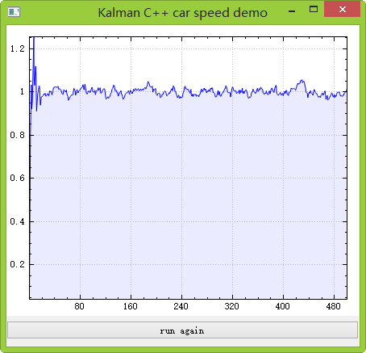
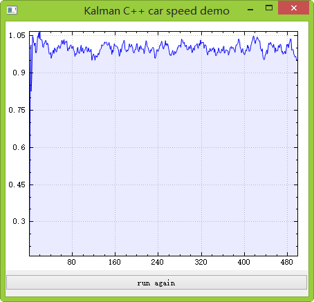
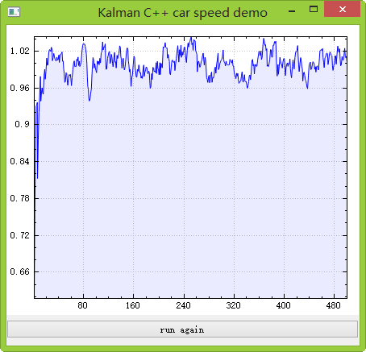

#Kalman Filter Used in Car Speed Detect Demo

[refer video](https://www.youtube.com/watch?v=2-lu3GNbXM8&index=9&list=WL)
the implement of kalman demo in the ref video on c++
###the matlab code for kalman
```matlab
Z =(1:100);
noise = randn(1,100);
Z = Z+ noise;
X=[0;0];
P=[1 0;0 1];
F=[1 1;0 1];
Q=[0.0001 0;0 0.0001];
H=[1 0];
R=1;
figure;
hold on;
for i=1:100

    X_ = F*X;
    P_=F*P*F' + Q;
    K = P_*H'/(H*P_*H'+R);
    X=X_ + K*(Z(i)-H*X_);
    P=(eye(2) -K*H)*P_;
    plot(X(1),X(2)); %横轴表示位置，纵轴表示速度
end

```

###result



